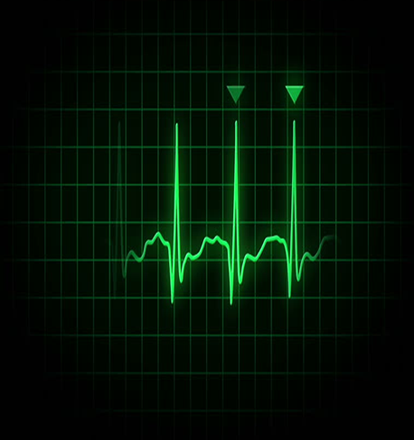

<h1 align="center"> ECG Signal Processing on Raspberi pi </h1>

  

This project implements a wearable ECG signal acquisition and monitoring system using a real-time embedded setup. It simulates analog ECG signals, filters them through hardware, and transmits clean data to a Raspberry Pi using an ESP8266 (NodeMCU). The signals are visualized live in a custom web interface powered by Plotly.js and Flask, while system stability is ensured via multithreaded communication. Data filtering, QRS detection, and real-time plotting are all integrated, making the system suitable for mobile health applications and cardiac diagnostics research.

## 📬 Contact

If you have any questions or feedback, feel free to contact us at:

📧 sepehrghamri@gmail.com